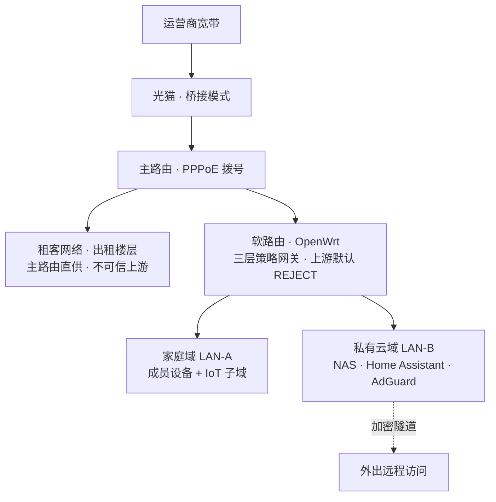
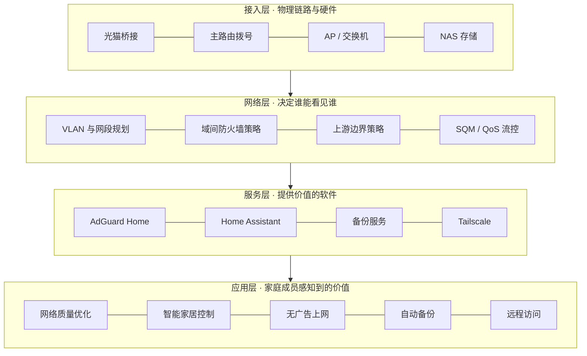

# 全屋网络与家庭私有云

> 把一条"只能上网"的家庭宽带链路，重构成**分层隔离、可运营的家庭私有云**。

一套多楼层住宅的网络与私有云架构设计：对外一张网，软路由下划分两个互不可见的信任域（家庭域 / 私有云域），并把**上游租客网段视为不可信边界**，其上叠加四项可交付服务——网络质量优化、智能家居中枢、全域广告过滤、私有存储与自动备份。

---

## 为什么做这件事

多楼层住宅的网络通常是"单层扁平结构"：一台主路由拨号，出租楼层的租客设备、自住楼层设备、智能家居、存储服务器落在同一个二层网络里。即使加一台软路由把自用资产划到内层，**它的上游接口仍然暴露在租客所在的广播域**。这带来三个被长期忽视的问题：

| 问题 | 具体表现 |
|---|---|
| **上游网段不可信** | 租客设备接在主路由下，与软路由 WAN 同处一个二层广播域——"它在我上一级"不等于安全，ARP 探测与端口扫描可以直接打到 WAN 口 |
| **没有账号体系** | 存储服务器只是一块共享盘，没有成员隔离、没有配额、没有自动备份闭环 |
| **没有边界意识** | 智能家居设备与私有存储同域，一台被攻破的廉价设备就能横向触达全部数据 |

这个项目的目标，是把"装了几个软件"变成**一套有结构的系统**。

---

## 核心设计：两个受管信任域 + 一条不可信上游边界

| 域 | 承载 | 可达 | 不可达 |
|---|---|---|---|
| **LAN-A 家庭域** | 成员手机 / 电视 / 智能家居 | 互联网、家庭服务、自己的私有云目录 | 私有云管理面、他人目录 |
| **LAN-B 私有云域** | NAS / Home Assistant / AdGuard | 互联网（仅必要端口） | 被任何客户端横向扫描 |
| **（边界）上游租客网段** | 出租楼层设备，主路由直供，**不在软路由管辖内** | 互联网 | **软路由下的全部资产**：WAN 侧入站默认拒绝，不放行任何端口 |

**隔离实现要点**

- 家庭域与私有云域以 VLAN + 独立网段划分，域间默认策略 `DROP`，仅白名单放行 DNS（53/853）、NTP、DHCP 与授权服务端口
- 私有云域关闭客户端间横向通信（AP/交换机端口隔离或网段内 ACL）
- **上游租客网段视为不可信**：软路由 WAN 与租客设备同处一个二层广播域，可被 ARP 探测与端口扫描，因此 WAN 侧 input / forward 默认 `REJECT`，不能依赖"它在我上一级"的安全假象
- 对 WAN 的例外放行必须收敛到**必要端口 + 必要源**，不允许出现无源限制的放行规则
- IoT 设备单独成域，只允许中枢单向访问，收敛横向渗透面

---

## 功能分层

应用层的用户价值由服务层提供，依赖网络层的策略与接入层的物理链路——**下层没打好，上层全是沙上城堡**。

---

## 主要功能

> **服务范围**：以下服务只覆盖**软路由下游的家庭网络**。上游租客网段不在软路由管辖内，限速、DNS 强制与广告过滤均无法覆盖。

1. **分层隔离与不可信上游边界** —— 软路由下以 802.1Q VLAN + 独立网段划分家庭域与私有云域，域间默认 `DROP`；上游租客网段视为不可信，WAN 侧入站默认拒绝。
2. **全域广告过滤** —— AdGuard Home 统一接管**软路由下全部终端**的 DNS，终端零配置生效；分层治理，明确区分「DNS 域名层能拦的」与「拦不到的」。
3. **跨品牌智能家居接入** —— Home Assistant 作为统一控制中枢，本地协议优先，支持通过自定义组件接入无官方 SDK 的设备，断网仍可控。
4. **家庭私有云与自动备份** —— 「账号 + 独立目录 + 容量配额」三级权限模型，成员数据互不可见；设备接入家庭网络即触发增量同步。
5. **远程安全访问** —— Tailscale / WireGuard 加密隧道，存储与管理端口零公网暴露。
6. **网络质量优化** —— SQM / QoS 智能流控治理缓冲区膨胀，本地 DNS 缓存与并行上游解析降低解析耗时。
7. **可观测与运维** —— 资源与服务存活监控看板、异常告警、配置版本化与一键备份恢复。

### 典型场景

- **回家自动归档** —— 手机连上家庭 WiFi，照片 / 视频 / 文档自动增量同步到自己的私有目录，无需任何手动操作。
- **出门带自己的媒体库** —— 外出时手机或车机通过 Tailscale 接入家庭 NAS，直接播放自建音乐服务器与提前下载好的 4K 影视库，**不依赖任何第三方会员**。
- **干净的家庭网络** —— 全家终端接入即被接管 DNS，网页与 App 的广告、跟踪域名在域名层被拦掉，手机与电视零配置生效。

---

## 关键设计决策

| 决策点 | 建议方案 | 理由 |
|---|---|---|
| 域间隔离实现 | VLAN + 独立 SSID | 复用现有硬件，无线侧同样可隔离 |
| 上游租客网段 | 视为不可信边界 | WAN 侧默认拒绝入站；不做"上一级所以安全"的假设 |
| 广告过滤位置 | 本地 AdGuard Home | 数据不出户，规则可自定义，配合抓包闭环 |
| 智能家居中枢 | 先容器化，资源吃紧则迁独立设备 | 低配小主机内存是明确瓶颈 |
| 远程访问 | Tailscale / WireGuard 隧道 | 不依赖公网 IP，暴露面最小 |
| 广告拦截边界 | 明确区分 L1 / L2 / L3 三层能力 | 提前管理预期，不承诺拦不掉的 |

---

## 量化目标

| 目标 | 指标 |
|---|---|
| 隔离有效 | 从上游租客网段扫描软路由 LAN 侧资产，越权可达端口数 = 0 |
| 广告过滤 | DNS 层拦截率 ≥ 15%，误杀率 < 1% |
| 网络质量 | 内网延迟抖动 < 2ms，DNS 平均解析 < 30ms |
| 备份闭环 | 增量备份成功率 ≥ 99%，接入 WiFi 后 5 分钟内完成 |
| 远程可用 | 外出访问可用性 ≥ 99% |
| 可维护 | 任一变更 15 分钟内可回滚 |

---

## 文档

- [`docs/PRD.md`](docs/PRD.md) —— 完整产品需求文档：问题定义、角色模型、信任域与上游边界设计、功能需求（含优先级与验收口径）、关键决策与权衡、路线图、资源预算。

---

## 技术栈

`OpenWrt` · `VLAN (802.1Q)` · `nftables` · `Docker` · `AdGuard Home` · `Home Assistant` · `Samba / WebDAV` · `Tailscale / WireGuard` · `SQM / QoS` · `mitmproxy`

---

## 硬件配置

实际部署使用的硬件。**只列型号与规格，不含 MAC 地址、IP、序列号等可定位信息。**

| 环节 | 设备 | 关键规格 |
|---|---|---|
| 光猫 | 运营商光猫 · 桥接模式 | 仅做光电转换，不承担路由与 NAT |
| 主路由 | **Xiaomi 路由器 BE5000**（硬件代号 RD18） | Wi-Fi 7 双频，支持 160MHz 与 Mesh；PPPoE 拨号，直供租客网络 |
| 软路由 | **Lenovo H3000**（机型 90C2007CCD） | Intel Pentium J2900 4 核 @2.41GHz / 4GB 内存 / 120GB SSD |
| 软路由网卡 | **Intel i226-V 双口 2.5GbE** | PCIe 扩展卡，**替换原独立显卡**；WAN 与 LAN 各占一口 |
| 板载网口 | Realtek RTL8136 百兆 | 未启用 |
| NAS | **自组 x86 主机 · 飞牛 OS (fnOS)** | 家庭私有云底座：多账号存储、音乐服务器、4K 影视库 |
| 远程访问 | Tailscale | 组网穿透，无公网端口暴露 |

### 硬件层面的两个取舍

1. **把原独立显卡换成 2.5G 双口网卡** —— 这台 H3000 是纯 headless 路由，不需要显示输出；腾出 PCIe 槽给双口 2.5GbE，WAN / LAN 各占一口，转发不再受板载百兆口拖累（板载 RTL8136 仅百兆，已闲置）。
2. **CPU 与功耗的平衡** —— J2900 是 Bay Trail-D 平台的 SoC，TDP 仅 10W，4 核足够承担 NAT 转发、AdGuard 与轻量容器。

### 功耗

| 状态 | 功耗（估算） |
|---|---|
| 待机（NAT + DNS） | 约 12–16 W |
| 日常负载（+ 广告过滤、容器、隧道） | 约 15–18 W |
| 满载（转发压力测试） | ≤ 28 W |

- 平台 TDP 10W，整机含 120GB SSD 与双口 2.5G 网卡
- 该平台**无 RAPL 功耗计数器**，以上为按 TDP 与同平台实测数据推算的**估算值**，非功率计实测
- 按 15W 均值计，全年约 131 kWh

---

## 关于本仓库

这是一个**设计文档仓库**，包含架构方法论、设计决策，以及实际使用的硬件清单：

- 网段、IP 地址均为示例值
- 硬件型号按作者意愿公开（见上节「硬件配置」）；住宅结构、主机名、设备序列号、MAC 地址均已泛化或省略
- 不含任何凭据、拓扑快照或配置备份

方案仍在迭代中，欢迎就架构取舍提出讨论。

---

## License

[MIT](LICENSE)
